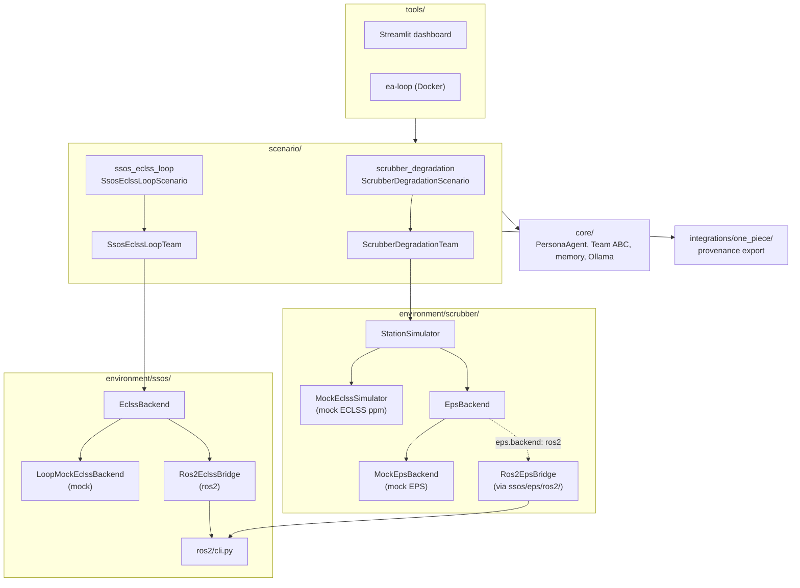
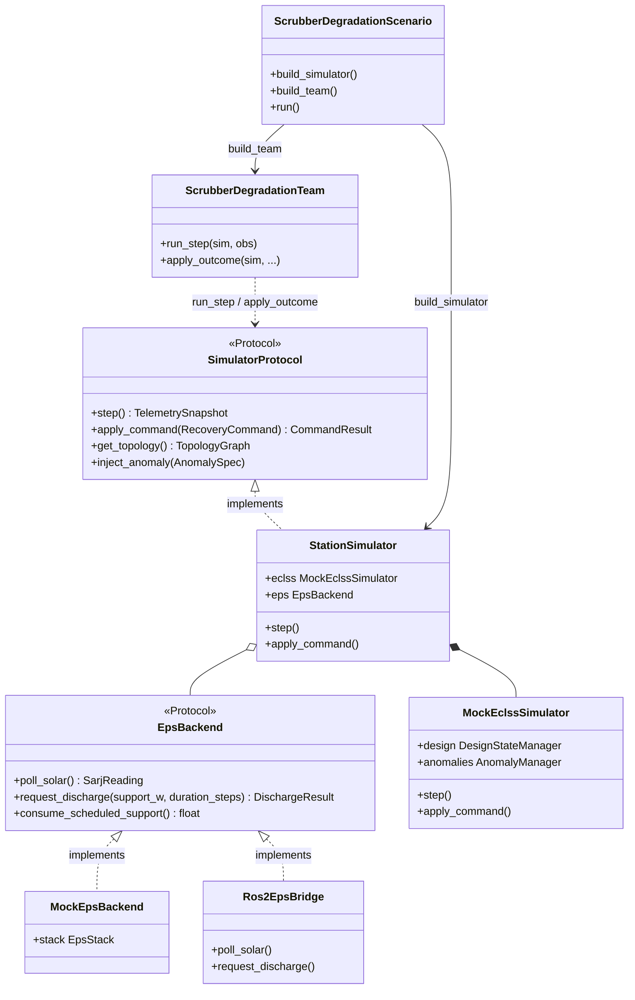
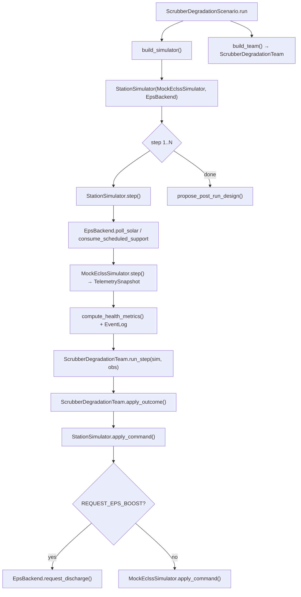
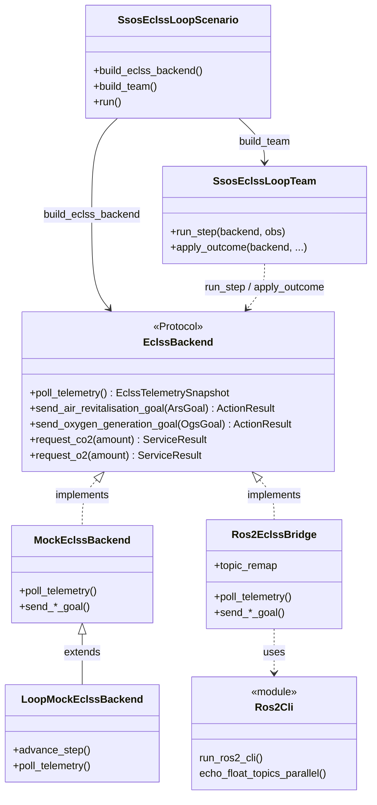
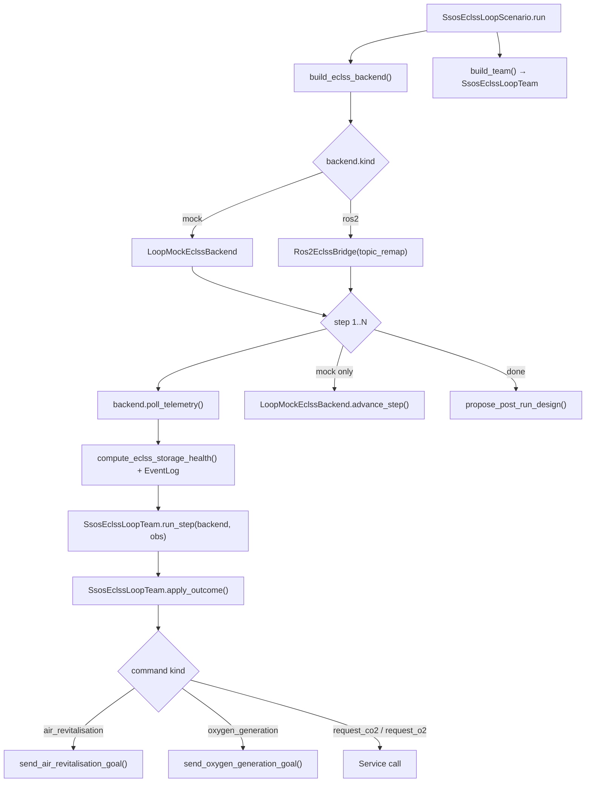

# Architecture — ECLSS Resilience Loop

Reference for layer structure, execution flow, and agent design. API schemas: [api-contracts.md](api-contracts.md). Scenario narratives: see each scenario document.

> Usage: [Quick start](index.md) · [Overview](overview.md) · Incomplete features: [development-plan.md](development-plan.md)

---

## Mission

Verify in a reproducible environment that an **agent team can detect and respond to anomalies in space-station life-support equipment (ECLSS)** and **propose design changes afterward**.

Priorities:

- **Structured agent relationships** (homogeneous team, representative action, deliberation logs)
- **Clear API contracts** (backend protocols, JSONL)
- **Two scenario tracks** — independent backends and output schemas (do not mix)


| | `scrubber_degradation` | `ssos_eclss_loop` |
| --- | --- | --- |
| Narrative | [scenario-scrubber-degradation.md](scenario-scrubber-degradation.md) | [scenario-ssos-eclss-loop.md](scenario-ssos-eclss-loop.md) |
| Backend | `SimulatorProtocol` / `StationSimulator` | `EclssBackend` / `Ros2EclssBridge` |
| Team | `ScrubberDegradationTeam` | `SsosEclssLoopTeam` |
| Rep IDs | `engineer_*` | `eclss_operator_*` |
| Runtime | Recovery commands | Operational commands (ARS/OGS, etc.) |
| Post-run | Scrubber topology | `ssos_graph` |
| Environment | Host Python only | mock or SSOS Docker |


---

## Shared — layers and dependencies

### System overview

`src/environment/` is split by scenario track. Each track owns its backends; mock and ROS2 variants live under the same subtree.

```text
environment/
  protocol.py              # shared scrubber types + SimulatorProtocol
  scrubber/                  # scrubber_degradation
    station_simulator.py     # StationSimulator (ECLSS + EPS facade)
    mock_eclss.py            # MockEclssSimulator (ppm plant)
    eclss_ops/               # anomalies, commands, design_state, telemetry
    eps/
      backend.py             # EpsBackend protocol
      mock/                  # MockEpsBackend → EpsStack (MockSarj, MockBcdu)
  ssos/
    ros2/cli.py              # shared ros2 CLI helpers (ECLSS + EPS bridges)
    eclss/                   # ssos_eclss_loop
      backend.py             # EclssBackend protocol
      mock/backend.py        # MockEclssBackend (contract stub)
      ros2/                  # Ros2EclssBridge, graph_rewire, topics
    eps/ros2/                # Ros2EpsBridge only — scrubber EPS option; not wired to eclss loop
```



**Dependency direction** (imports are one-way only):

```text
tools → scenario → environment → core
src/integrations/   (invoked from scenario)
```

### Layer responsibilities

| Layer | Path | Responsibility |
| --- | --- | --- |
| Core | `src/core/` | Persona, Team ABC, memory, LLM client |
| Environment | `src/environment/` | `scrubber/`: `SimulatorProtocol`, mock ECLSS ppm, mock EPS (`MockEpsBackend` or `Ros2EpsBridge`). `ssos/eclss/`: `EclssBackend`, mock \| ros2, `graph_rewire`. `ssos/ros2/cli.py`: shared ROS2 CLI. `ssos/eps/ros2/`: EPS bridge (scrubber optional; not used by eclss loop) |
| Scenario | `src/scenario/` | Per-scenario YAML, Team, `design_proposals` |
| Experiments | `src/experiments/results/` | Run output |
| Tools | `src/tools/dashboard/` | Streamlit (view branches on `summary.scenario`) |
| Integrations | `src/integrations/one_piece/` | provenance JSON |

### Agent team (shared across both tracks)

Extends `Team` ABC. **Homogeneous N agents + representative action**, not rigid roles. scrubber optionally assigns **thinking-style archetypes** via `team.archetypes`.

| Concept | Description |
| --- | --- |
| `team.count` | Operator count (scrubber default 4, ssos default 3) |
| `team.archetypes` | Optional list of thinking lenses (scrubber default: all four). Round-robin onto `agent_id`s. Omit or `[]` for legacy homogeneous team |
| deliberation | llm: one round for all (archetype lens + shared persona when set). labeled: rule-driven fixed messages |
| action rep | Representative issues commands each step via `(step-1) % N` |
| post-run rep | Representative at final step outputs `design_proposals.json` |
| Design separation | **No permanent graph changes at runtime**. Post-run proposals only |

#### Thinking-style archetypes (`team.archetypes`)

Implemented in `src/core/agents/persona.py` (`ARCHETYPE_LENSES`, `load_team`, `build_personas`). Scenario-independent **ways of thinking**, not fixed roles or threshold catalogues.

| Lens | Intent |
| --- | --- |
| `first_principles` | Conservation laws, mass/energy balance from the ground up |
| `failure_mode` | FMEA-style — secondary failures and worst-case interactions |
| `improviser` | Smallest intervention reusing resources already on hand |
| `systems_integrator` | Cross-subsystem coupling and side-effects of local fixes |

**Assignment**: lens names map **round-robin** onto `agent_ids` (`engineer_1` gets the first lens, etc.). Fewer lenses than agents repeats the list.

**Composition**: when archetypes are set, each agent's prompt is `ARCHETYPE_LENSES[lens]\n\n{team.persona}`. Omit `archetypes` or set `[]` for the legacy homogeneous team (identical shared persona for all agents).

| Mode | Persona effect |
| --- | --- |
| `llm` | Composed persona drives deliberation and post-run proposals |
| `labeled_rule_base` | Rules ignore personas; archetypes still recorded in `summary.json["archetypes"]` for composition→outcome studies |

**Run output**: `summary.json["archetypes"]` maps `agent_id` → lens name (`{}` when disabled). Default scrubber config ships all four lenses. Disable via override:

```python
run_scenario(
    "scrubber_degradation",
    overrides={"agents": {"team": {"archetypes": []}}},
)
```

Unknown lens names raise `ValueError` at team load. `ssos_eclss_loop` ships without `team.archetypes` by default.

Details: [memo/agents/homogeneous_agent_team_plan.md](memo/agents/homogeneous_agent_team_plan.md). Implementation: `src/core/agents/persona.py`.

### `agents.mode` (shared values)

| Mode | Meaning |
| --- | --- |
| `none` | Backend only (no agents) |
| `labeled_rule_base` | `policy` / threshold driven |
| `llm` | Ollama deliberation + representative action |
| `base` | Not implemented ([BL-001](memo/backlog.md)) |

**Do not include `policy` thresholds in LLM prompts** (fair comparison experiments).

### Implementation status

| Feature | scrubber | ssos |
| --- | --- | --- |
| Scenario + team | ✅ frozen | ✅ Phase 0–7 |
| labeled / llm | ✅ | ✅ |
| Dashboard | ✅ ppm / EPS / topology | ✅ storage / operational TL |
| provenance | ✅ EPS recovery | ✅ operational commands |
| Post-run proposals → provenance | 📋 pending | 📋 pending |
| CLI integration | 📋 pending | 📋 pending |
| launch remap (Phase 8) | — | 📋 [BL-003](memo/backlog.md#bl-003-ros-launch-remap-phase-8--graph_rewire-a) |

---

## scrubber_degradation

CO₂ scrubber anomaly on Python mock. **Frozen** — new features go to `ssos_eclss_loop`.

### Terminology

| Abbrev. | Description |
| --- | --- |
| **ECLSS** | Life-support plant (scrubber, manifold, cabin) |
| **EPS** | Generation, storage, distribution. Supports ECLSS via `request_eps_boost` |
| **SARJ** / **BCDU** | Solar generation / battery discharge mocks (`MockSarj` / `MockBcdu`) |

### Execution flow

```text
scenario.yaml + agents.yaml
        │
        ▼
  scenario/scrubber_degradation/scenario_run.py → ScrubberDegradationScenario
        │
        ├─ build_simulator() → StationSimulator(MockEclssSimulator, EpsBackend)
        ├─ build_team()      → ScrubberDegradationTeam
        │
        ▼
  for step in 1..N:
    1. sim.step()                    → TelemetrySnapshot
    2. log telemetry, health, design_state
    3. team.run_step(sim, obs)       → RecoveryCommand
    4. team.apply_outcome(sim, ...)  → apply_command only
    5. log messages, events
        │
        ▼
  propose_post_run_design() → design_proposals.json
  export_run_provenance()   → recovery records
```

### Environment layout

| Path | Role |
| --- | --- |
| `environment/protocol.py` | Shared datatypes (`TelemetrySnapshot`, `RecoveryCommand`, …) and `SimulatorProtocol` |
| `environment/scrubber/station_simulator.py` | `StationSimulator` — couples ECLSS plant with EPS backend |
| `environment/scrubber/mock_eclss.py` | `MockEclssSimulator` — ppm scrubber plant model |
| `environment/scrubber/eclss_ops/` | Anomalies, command validation, design state, health helpers |
| `environment/scrubber/eps/backend.py` | `EpsBackend` protocol |
| `environment/scrubber/eps/mock/` | `MockEpsBackend`, `EpsStack`, `MockSarj`, `MockBcdu` |
| `environment/ssos/eps/ros2/bridge.py` | `Ros2EpsBridge` — optional live EPS when `eps.backend: ros2` |
| `scenario/scrubber_degradation/scenario_run.py` | `ScrubberDegradationScenario` run loop |
| `scenario/agents/scrubber_degradation_team.py` | `ScrubberDegradationTeam` |
| `scenario/runner.py` | `build_simulator()`, `build_eps_backend()` factory helpers |

EPS backend selection (`scenario/runner.py` → `build_eps_backend`):

| `eps.backend` | Implementation |
| --- | --- |
| `mock` (default) | `MockEpsBackend` — in-memory SARJ/BCDU |
| `ros2` / `ssos_eps` | `Ros2EpsBridge` — SSOS Docker via `ssos/ros2/cli.py` |

### Class structure



Step loop (scenario ↔ environment):



### Runtime vs post-run

| Phase | Content | Output |
| --- | --- | --- |
| Runtime | Recovery commands (fan, load, EPS, bypass) | `recovery_applied` |
| Post-run | Scrubber topology proposal (not applied to simulator) | `design_proposals.json` |

`design_state.jsonl` topology is invariant during the run. Dashboard After preview is a **virtual apply** of proposals.

### ECLSS + EPS stack

```text
StationSimulator                          # scrubber/station_simulator.py
  ├─ MockEclssSimulator                   # scrubber/mock_eclss.py
  │    └─ scrubber/eclss_ops/             # anomalies, commands, design_state
  └─ EpsBackend                           # scrubber/eps/backend.py
       ├─ MockEpsBackend                  # scrubber/eps/mock/ (default)
       │    └─ EpsStack (MockSarj, MockBcdu)
       └─ Ros2EpsBridge                   # ssos/eps/ros2/ (eps.backend: ros2)
```

Topology:

```text
  cabin ──flow──► manifold ──flow──► scrubber ──flow──► cabin
                                        ▲
                                        │ power
                                   power_bus
```

### Health (ppm / power)

`compute_health_metrics()` — `src/environment/scrubber/eclss_ops/telemetry.py`

| Metric | safe | warning | critical |
| --- | --- | --- | --- |
| CO₂ (ppm) | < 800 | 800 to < 1200 | ≥ 1200 |
| Power margin (W) | > 0 | 0 to < −150 | ≤ −150 |

`policy.co2_recovery_ppm` (1000, etc.) are recovery triggers, separate from health bands.

### Agents

| `agents.mode` | Runtime | Post-run | Tests |
| --- | --- | --- | --- |
| `none` | Sim only | — | `test_scrubber_baseline.py` |
| `labeled_rule_base` | policy-driven recovery | bypass proposal | `test_scrubber_with_agents.py` |
| `llm` | deliberation + commands | LLM changes | same (Fake LLM) |

#### labeled_rule_base

| Behavior | Trigger |
| --- | --- |
| `set_fan_speed` | CO₂ ≥ `co2_recovery_ppm` |
| `reduce_load` / `request_eps_boost` | power critical |
| `enable_bypass` | high CO₂ + fan already applied |
| Post-run bypass proposal | peak CO₂ high or `anomaly_seen` |

#### llm

1. Deliberation (all N) → 2. Action (representative `commands`) → 3. Post-run (`changes`)

Prompt: `### Telemetry` + `### World state` (no policy)

### Output and dashboard

| Unique files | Content |
| --- | --- |
| `eps_telemetry.jsonl` | SARJ + BCDU |
| `events.jsonl` | anomaly, `recovery_applied` |

| View | Content |
| --- | --- |
| Overview | CO₂ ppm, power, EPS, topology Before/After |
| Step replay | Recovery timeline, reasoning |

run ID: `scrubber_degradation_{baseline|labeled_rule_base|llm}`

---

## ssos_eclss_loop

Real ROS2 ECLSS inside SSOS Docker (or `LoopMockEclssBackend`). **Does not use `SimulatorProtocol`.**

### Terminology

| Abbrev. | Description |
| --- | --- |
| **ARS** | Air Revitalisation — CO₂ removal (`air_revitalisation`) |
| **OGS** | Oxygen Generation — O₂ generation (`oxygen_generation`) |
| **WRS** | Water Recovery — water recovery (`water_recovery_systems`) |

### Execution flow

```text
scenario.yaml + agents.yaml (+ ssos_graph.rewires optional)
        │
        ▼
  scenario/ssos_eclss_loop/scenario_run.py → SsosEclssLoopScenario
        │
        ├─ build_eclss_backend() → LoopMockEclssBackend | Ros2EclssBridge(topic_remap)
        ├─ build_team()            → SsosEclssLoopTeam
        │
        ▼
  for step in 1..N:
    1. backend.poll_telemetry()      → EclssTelemetrySnapshot
    2. log telemetry, health, design_state
    3. team.run_step(backend, obs)  → EclssOperationalCommand
    4. team.apply_outcome(...)      → Action/Service, re-arm logic
    5. log messages, operational events
        │
        ▼
  propose_post_run_design() → design_proposals.json (ssos_graph)
  export_run_provenance()   → operational records
```

### Environment layout

| Path | Role |
| --- | --- |
| `environment/ssos/eclss/backend.py` | `EclssBackend` protocol |
| `environment/ssos/eclss/types.py` | Storage telemetry, goals, action/service results |
| `environment/ssos/eclss/mock/backend.py` | `MockEclssBackend` — no-op contract stub |
| `scenario/ssos_eclss_loop/loop_mock_backend.py` | `LoopMockEclssBackend` — storage dynamics for mock runs |
| `environment/ssos/eclss/ros2/bridge.py` | `Ros2EclssBridge` — live SSOS ECLSS via ros2 CLI / rclpy |
| `environment/ssos/eclss/ros2/graph_rewire.py` | `build_topic_remap()` for Phase 7 client remaps |
| `environment/ssos/eclss/ros2/topics.py` | Action/service/topic names |
| `environment/ssos/ros2/cli.py` | Shared `run_ros2_cli`, parallel topic echo, parsing helpers |
| `environment/ssos/eps/ros2/` | `Ros2EpsBridge` — **EPS only**; used by scrubber, not this loop |
| `scenario/ssos_eclss_loop/scenario_run.py` | `SsosEclssLoopScenario`, `build_eclss_backend()` |
| `scenario/agents/ssos_eclss_loop_team.py` | `SsosEclssLoopTeam` |

Backend selection (`build_eclss_backend` in `scenario_run.py`):

| `backend.kind` | Implementation |
| --- | --- |
| `mock` (default) | `LoopMockEclssBackend` — host dev, simple CO₂/O₂ dynamics |
| `ros2` | `Ros2EclssBridge` — SSOS Docker; optional `ssos_graph.rewires` → `topic_remap` |

Override via CLI `--backend mock|ros2`, config `backend.kind`, or env `SSOS_ECLSS_BACKEND`.

### Class structure



Step loop (scenario ↔ environment):



### Runtime vs post-run

| Phase | Content | Output |
| --- | --- | --- |
| Runtime | ARS/OGS/WRS operational commands | `operational_applied` |
| Post-run | `action_profile` / `graph_rewire` proposals | `design_proposals.json` |

**graph_rewire (Phase 7)**: client `topic_remap` on next run's `Ros2EclssBridge`. Launch remap (Phase 8) is backlog.

### ECLSS stack

```text
SsosEclssLoopTeam                         # scenario/agents/ssos_eclss_loop_team.py
  └─ EclssBackend                         # ssos/eclss/backend.py
       ├─ LoopMockEclssBackend             # scenario/.../loop_mock_backend.py (mock)
       │    └─ extends MockEclssBackend   # ssos/eclss/mock/backend.py
       └─ Ros2EclssBridge                  # ssos/eclss/ros2/bridge.py (ros2)
            ├─ ssos/ros2/cli.py           # shared CLI helpers
            └─ topic_remap                # graph_rewire from ssos_graph.rewires
```

```text
  metabolic CO₂ ──► /co2_storage ──► ARS
  /o2_storage ◄── OGS ◄── request_co2 (Sabatier)
  /wrs/product_water_reserve ◄── WRS
```

`run_ssos_eclss_loop.sh` / `ea-loop` for container runs. ECLSS headless startup is required.

### Health (storage kg)

`compute_eclss_storage_health()` — `src/scenario/ssos_eclss_loop/health.py`

| Metric | safe | warning | critical |
| --- | --- | --- | --- |
| CO₂ (kg) | < 1500 | 1500 to < 2200 | ≥ 2200 |
| O₂ (kg) | > 450 | 337.5 to 450 | ≤ 337.5 |
| Product water (L) | > 50 | 25 to 50 | ≤ 25 |

`thresholds.co2_storage_high_kg`, etc. are operational triggers, separate from health bands.

### Agents

| `agents.mode` | Runtime | Post-run | Tests |
| --- | --- | --- | --- |
| `none` | poll only | — | `test_ssos_eclss_loop_scenario.py` |
| `labeled_rule_base` | thresholds → ARS/OGS | `ssos_graph` | `test_ssos_eclss_loop_team.py` |
| `llm` | deliberation + operational | LLM changes | same |

#### labeled_rule_base

`thresholds` (scenario.yaml) + `policy` profile (agents.yaml). Thresholds merged via `merge_labeled_policy_from_thresholds()`.

| Behavior | Trigger |
| --- | --- |
| `air_revitalisation` | CO₂ ≥ high, ARS not yet dispatched |
| `request_co2` | O₂ ≤ low, before OGS (policy default ON) |
| `oxygen_generation` | O₂ ≤ low, OGS not yet dispatched |
| re-arm | retry next step if no improvement |

#### llm

Same pattern as scrubber. Prompt includes storage kg and health state (no policy).

### Output and dashboard

| Unique fields | Content |
| --- | --- |
| `summary.backend` | `mock` / `ros2` |
| `summary.operational_command_count` | operational command count |
| `events.jsonl` | `operational_applied` |

**Not in ssos from scrubber**: `eps_telemetry.jsonl`, ppm-based KPIs.

| View (`ssos_views.py`) | Content |
| --- | --- |
| Overview | storage kg, health cards, 2-run compare |
| Step replay | operational timeline, `ssos_graph` proposals |

run ID: `ssos_eclss_loop_{baseline|labeled_rule_base|llm}`

Connection details: [memo/ssos_eclss_loop/ssos_eclss_loop_connection_plan.md](memo/ssos_eclss_loop/ssos_eclss_loop_connection_plan.md)

---

## External systems

| System | Track | Status |
| --- | --- | --- |
| Python mock ECLSS + EPS | scrubber | ✅ `environment/scrubber/` — `StationSimulator`, `MockEpsBackend` |
| SSOS live ECLSS | ssos | ✅ `environment/ssos/eclss/ros2/` — `Ros2EclssBridge` |
| SSOS EPS (scrubber power) | scrubber | ✅ `environment/ssos/eps/ros2/` — `Ros2EpsBridge` (optional via `eps.backend: ros2`) |
| SSOS EPS (eclss loop) | ssos | — not wired; `ssos/eps/ros2/` is separate from eclss loop |
| Ollama | both | ✅ container uses `host.docker.internal` |
| One Piece Web UI | — | out of scope |

---

## Development setup

```bash
python3 -m venv .venv && source .venv/bin/activate
pip install -e ".[dev]"
pytest
```

Regression:

```bash
# scrubber
pytest tests/scenario/test_scrubber_baseline.py tests/scenario/test_scrubber_with_agents.py -q
# ssos
pytest tests/scenario/test_ssos_eclss_loop*.py tests/environment/test_graph_rewire*.py -q
```

SSOS container E2E (orchestrated):

```bash
./scripts/run_ssos_regression.sh              # Tier 1: pytest only
SSOS_E2E=1 ./scripts/run_ssos_regression.sh   # Tier 2: container smoke chain + ea-loop
```

Individual container scripts (debugging): `./scripts/run_ssos_eclss_loop.sh`, `./scripts/run_graph_rewire_e2e.sh`

### Cursor subagents (`.cursor/agents/`)

Project-scoped subagent prompts for Cursor. Parent agents delegate exploration or debugging; subagents return concise summaries.

| Agent | Mode | Use when |
| --- | --- | --- |
| `codebase-explorer` | readonly | Architecture research, symbol search, dependency tracing |
| `debugger` | read-write | Test failures, CI errors, minimal fixes with pytest verification |

Both agents enforce layer discipline (`tools → scenario → environment → core`) and repository guardrails from [AGENTS.md](AGENTS.md). Prompts live in `.cursor/agents/*.md` (not user-global `~/.cursor/agents/`).

Next implementation: [development-plan.md](development-plan.md) · API details: [api-contracts.md](api-contracts.md)
