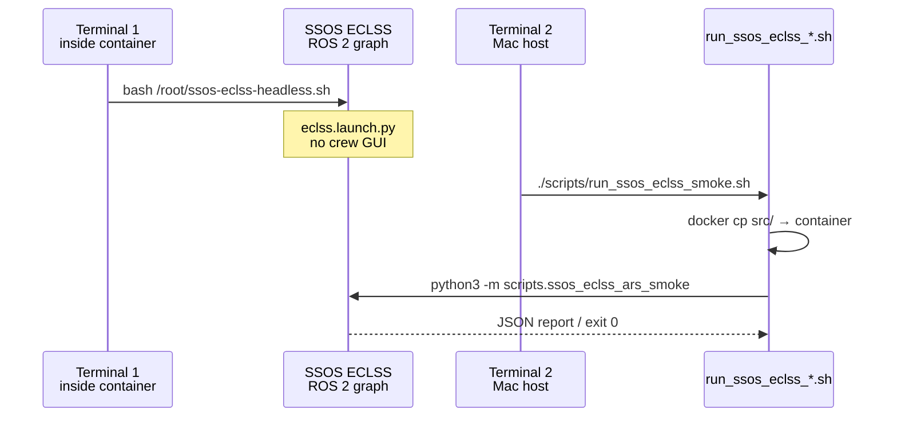

# Quickstart

SSOS integration smoke tests and the `ssos_eclss_loop` **ros2** backend. **The Mac host has no ROS 2** — the real plant runs in Docker, and you start simulations from the **host** with `ea run`.

!!! info "Start here for a first run"
    If you only need a quick mock simulation without Docker, use the [Quick start](../index.md) page (`ea run ssos_eclss_loop --backend mock`).

Scenario specification: [ssos_eclss_loop scenario](../scenario-ssos-eclss-loop.md)

---

## ssos_eclss_loop — command cheat sheet (Mac)

### First time: setup through simulation

Once per machine. Run on the **host** terminal only.

```bash
cd /path/to/engineering_agents

# Python CLI
python3 -m venv .venv
source .venv/bin/activate
pip install -e ".[dev]"

# SSOS container (mounts helpers to /root/)
./scripts/ssos/mac/ssos-run-detached.sh

# Optional: verify
docker ps --filter name=ssos
docker exec ssos test -f /root/ssos-eclss-headless.sh && echo "headless helper OK"

# Simulation
ea run ssos_eclss_loop --agents-mode labeled_rule_base --steps 50

# Results
ea results
```

Output: `src/experiments/results/ssos_eclss_loop_labeled_rule_base/` (`telemetry.jsonl`, `summary.json`, etc.)

Details: [CLI guide — SSOS Docker](../cli.md#ssos-docker-ssos_eclss_loop--ros2)

### After setup: simulation only

**Container is Up** (`docker ps --filter name=ssos`):

```bash
cd /path/to/engineering_agents
source .venv/bin/activate
ea run ssos_eclss_loop --agents-mode labeled_rule_base --steps 50
ea results
```

**Container is stopped** (`Exited` in `docker ps -a`):

```bash
docker start ssos
cd /path/to/engineering_agents
source .venv/bin/activate
ea run ssos_eclss_loop --agents-mode labeled_rule_base --steps 50
ea results
```

!!! tip "Remember"
    - Run `ea run` on the **host** only (not inside the container)
    - **Headless restarts before every run** to reset plant state (no manual second terminal)
    - For LLM agents, start Ollama on the host and pass `--agents-mode llm`

---

## Prerequisites (details)

### 1. SSOS Docker container

| Item | Typical value |
| --- | --- |
| Container name | `ssos` (`SSOS_CONTAINER` / `SSOS_CONTAINER_NAME`) |
| Image | `ghcr.io/space-station-os/space_station_os:latest` |
| ROS distro | **Jazzy** (`/opt/ros/jazzy/setup.bash`) |
| Workspace | `~/ssos_ws/install/setup.bash` |

See the [command cheat sheet](#ssos_eclss_loop--command-cheat-sheet-mac) at the top. Helpers under `scripts/ssos/` mount to `/root/`.

!!! note "Legacy smoke workflow"
    The **two-terminal workflow** below (manual headless + `docker cp`) is for Phase 1a smoke tests. For normal `ssos_eclss_loop` runs, use `ea run` as above.

### 2. engineering_agents dev environment

```bash
cd /path/to/engineering_agents
pip install -e ".[dev]"
pytest --ignore=tests/e2e   # regression check (expect ~205 passed, 4 skipped)
```

### 3. Environment variables (optional)

| Variable | Default | Purpose |
| --- | --- | --- |
| `SSOS_CONTAINER` | `ssos` | Target container for smoke wrappers |
| `SSOS_CONTAINER_REPO` | `/ea` | Sync destination inside container |
| `ROS_DOMAIN_ID` | ECLSS: unset / EPS: `23` | DDS domain (EPS smoke wrapper exports 23) |
| `SSOS_ECLSS_BACKEND` | — | Backend override for `ssos_eclss_loop` (`mock` \| `ros2`) |

!!! warning "Mac Docker and DDS"
    Mac Docker Desktop does not support `--network=host`. Direct DDS from the Mac host to the SSOS ROS graph is **not recommended**. Smoke wrappers use `docker cp` + `docker exec` to run inside the container.

---

## Two-terminal workflow (ECLSS smoke)



### Terminal 1 — headless ECLSS

```bash
docker exec -it ssos bash
bash /root/ssos-eclss-headless.sh
# Stop with Ctrl+C. Keep running while smoke tests execute.
```

Equivalent command:

```bash
ros2 launch space_station eclss.launch.py
```

### Terminal 2 — Phase 1a ARS smoke (host repo root)

```bash
cd /path/to/engineering_agents
chmod +x scripts/run_ssos_eclss_smoke.sh   # first time only
./scripts/run_ssos_eclss_smoke.sh
# Save JSON: ./scripts/run_ssos_eclss_smoke.sh --json-out /tmp/eclss_smoke.json
```

**Pass criteria**: exit code 0, `/co2_storage` and `/ars/diagnostics` exist, `air_revitalisation` goal SUCCEEDED.

### Phase 1b / 2 smoke (same Terminal 1 prerequisite)

```bash
./scripts/run_ssos_eclss_1b_smoke.sh    # ARS + OGS + Sabatier signal
./scripts/run_ssos_eclss_2_smoke.sh     # + WRS + potable water tradeoff
```

---

## EPS smoke (Phase 3)

EPS requires a **full station or EPS launch**. ECLSS headless alone may not expose solar/BCDU topics.

```bash
# Terminal 1 (example: full station — inside container)
ros2 launch space_station space_station.launch.py
# Or EPS only: ros2 launch space_station eps.launch.py

# Terminal 2 (host)
./scripts/run_ssos_eps_smoke.sh
./scripts/run_ssos_eps_smoke.sh --arm-discharge-w 100 --arm-duration-steps 3
```

---

## ssos_eclss_loop scenario (Mock — no ROS)

```bash
cd /path/to/engineering_agents
PYTHONPATH=src python3 -m scenario.ssos_eclss_loop.scenario_run --backend mock
PYTHONPATH=src python3 -m scenario.ssos_eclss_loop.scenario_run \
  --backend mock --agents-mode labeled_rule_base --steps 8
```

Output: `src/experiments/results/ssos_eclss_loop_baseline/` (`telemetry.jsonl`, `health_metrics.jsonl`, `summary.json`)

---

## ssos_eclss_loop (ROS2 — recommended: `ea run` from host)

See the [command cheat sheet](#ssos_eclss_loop--command-cheat-sheet-mac) above. Legacy path only below.

### Legacy: run directly inside the container

Manual headless + `docker cp` path (debugging):

```bash
source /opt/ros/jazzy/setup.bash
source ~/ssos_ws/install/setup.bash
cd /ea   # default sync destination (override with SSOS_CONTAINER_REPO)
PYTHONPATH=/ea/src SSOS_ECLSS_BACKEND=ros2 EA_RESULTS_ROOT=/ea/results \
  python3 -m scenario.ssos_eclss_loop.scenario_run --backend ros2
```

---

## Container E2E regression (one command)

`scripts/run_ssos_regression.sh` chains **Tier 1** (host `pytest`) and optional **Tier 2** (live SSOS Docker smokes + `ea-loop`). Shared helpers live in `scripts/lib/ssos_docker.sh`.

### Tier 1 — default (no Docker)

```bash
./scripts/run_ssos_regression.sh
# Runs pytest (excluding tests/e2e); prints "Tier 2 skipped"
```

### Tier 2 — full SSOS container chain

Requires Docker and the SSOS image (`ghcr.io/space-station-os/space_station_os:latest`). The script can create a managed container (`ssos-regression-<pid>`), launch headless ECLSS, sync `src/`, and run:

1. ARS smoke → 1b smoke → WRS smoke → graph rewire smoke
2. `ssos_eclss_loop` with `labeled_rule_base` (default 5 steps)

```bash
SSOS_E2E=1 ./scripts/run_ssos_regression.sh
# Artifacts: artifacts/ssos-regression/<timestamp>/
```

| Flag / env | Effect |
| --- | --- |
| `--skip-pytest` | Tier 2 only (implies `SSOS_E2E=1`) |
| `--with-eps` | Use `ssos-headless.sh` and run EPS smoke |
| `--with-llm` | Also run `ea-loop` in `llm` mode (needs Ollama on host) |
| `--use-existing` | Reuse running `SSOS_CONTAINER`; no create/teardown |
| `--keep-container` | Do not remove managed container on exit |
| `--steps N` | `ea-loop` simulation steps (default: 5) |
| `SSOS_IMAGE` | Override pre-built image |
| `SSOS_ROS_DOMAIN_ID` | DDS domain inside container (default: `23`) |

Pytest hook (Tier 2 via pytest):

```bash
SSOS_E2E=1 pytest tests/e2e/test_ssos_regression.py -m ssos_e2e
```

### CI (`.github/workflows/ssos-e2e.yml`)

| Job | When | What |
| --- | --- | --- |
| `pytest` | Every PR | Full pytest + `test_regression_tier1_pytest_only` |
| `ssos-e2e` | `workflow_dispatch` or weekly cron (Mon 03:00 UTC) | Tier 2 on self-hosted `ssos` runner |

Manual Tier 2 from GitHub Actions: **Actions → SSOS E2E Regression → Run workflow** (optional `with_eps`, `with_llm`, `use_existing`).

---

## Browse docs locally

MkDocs Material local preview:

```bash
pip install -e ".[dev]"
mkdocs serve
# → http://127.0.0.1:8000/en/ssos/  (SSOS integration section)
```

Static build:

```bash
mkdocs build
# Output: site/ — deploy to any static host or GitHub Pages
```

On GitHub you can browse `docs/en/ssos/index.md` directly (Mermaid renders natively).

---

## Next steps

- [ECLSS integration](eclss-integration.md) — Action types and Service details
- [EPS integration](eps-integration.md) — `request_eps_boost` mapping
- [Troubleshooting](troubleshooting.md) — common failure patterns
