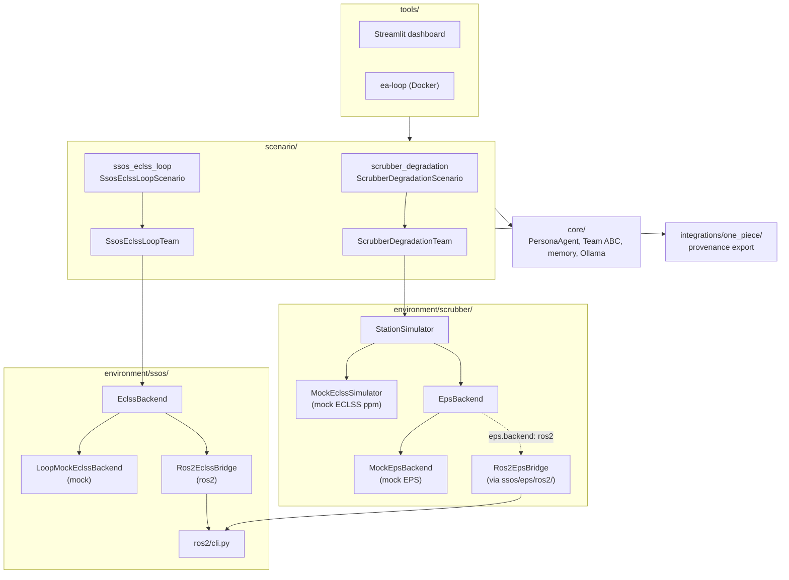
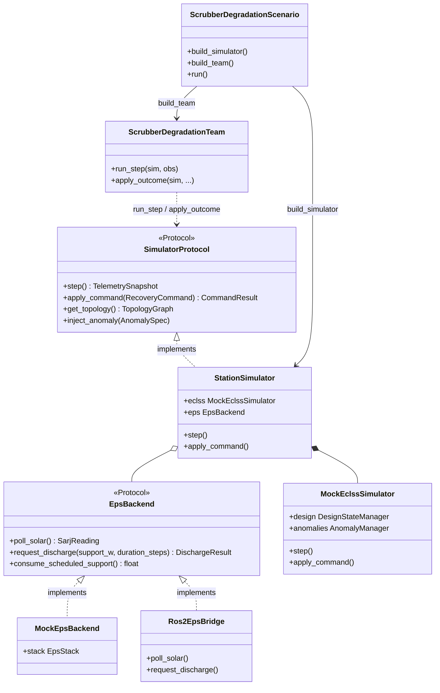
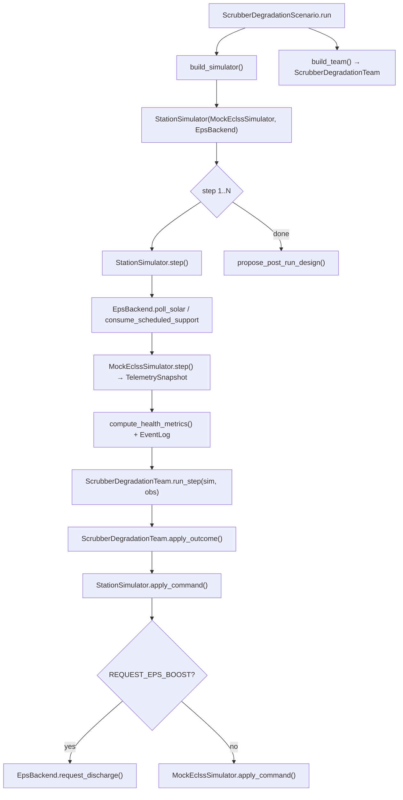
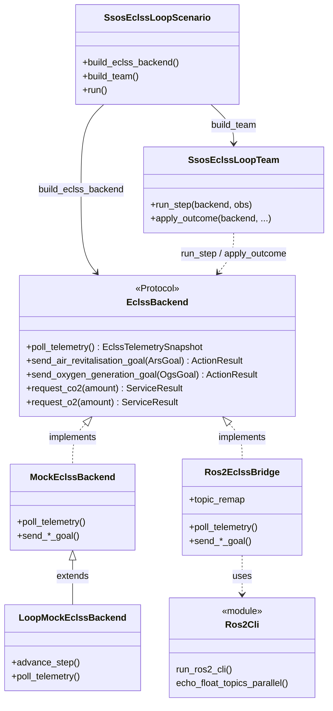
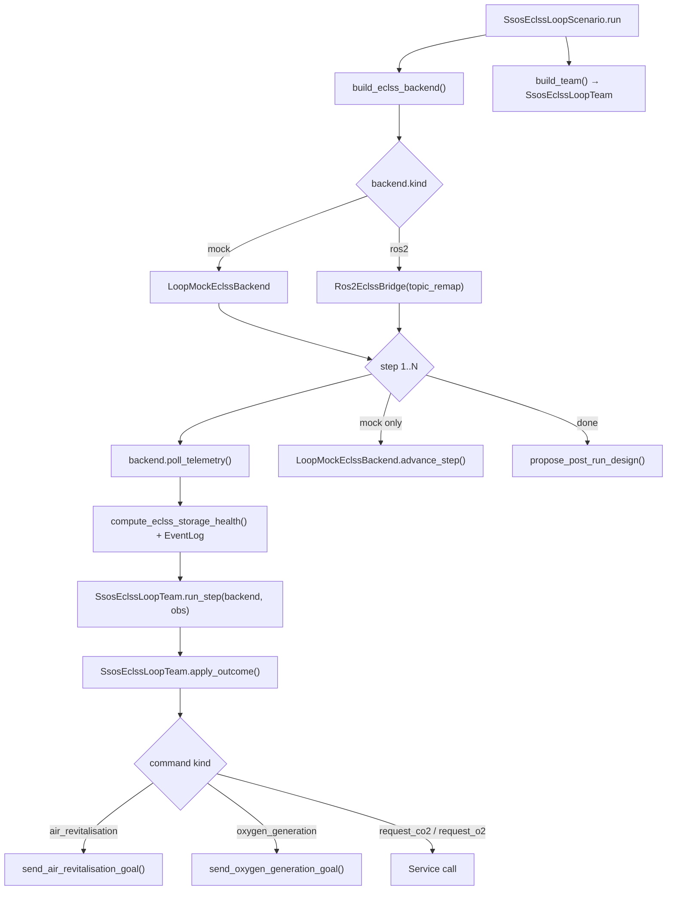

# アーキテクチャ — ECLSS レジリエンス・ループ

レイヤ構成・実行フロー・エージェント設計のリファレンス。API スキーマは [api-contracts.md](api-contracts.md)、叙事は各シナリオドキュメントを参照。

> 利用手順: [クイックスタート](index.md) · [概要](overview.md) · 未完了: [development-plan.md](development-plan.md)

---

## ミッション

宇宙ステーションの **生命維持装置（ECLSS）** における異常・運用負荷に対し、**エージェントチームが検知・対応し、事後に設計変更を提案する**までを再現可能な環境で検証する。

優先するもの:

- **構造化されたエージェント関係**（同種チーム、代表 action、議論ログ）
- **明確な API 契約**（バックエンドプロトコル、JSONL）
- **二系統のシナリオ** — 独立したバックエンドと出力スキーマ（混在しない）


|        | `scrubber_degradation`                                               | `ssos_eclss_loop`                                          |
| ------ | -------------------------------------------------------------------- | ---------------------------------------------------------- |
| 叙事     | [scenario-scrubber-degradation.md](scenario-scrubber-degradation.md) | [scenario-ssos-eclss-loop.md](scenario-ssos-eclss-loop.md) |
| バックエンド | `SimulatorProtocol` / `StationSimulator`                             | `EclssBackend` / `Ros2EclssBridge`                         |
| チーム    | `ScrubberDegradationTeam`                                            | `SsosEclssLoopTeam`                                        |
| 代表 ID  | `engineer_`*                                                         | `eclss_operator_*`                                         |
| ランタイム  | 回復コマンド                                                               | 運用コマンド（ARS/OGS 等）                                          |
| 事後提案   | scrubber トポロジ                                                        | `ssos_graph`                                               |
| 実行環境   | ホスト Python のみ                                                        | mock または SSOS Docker                                       |


---

## 共通 — レイヤと依存

### システム全体像

`src/environment/` はシナリオ系統ごとに分割される。各系統がバックエンドを所有し、mock と ROS2 実装は同一サブツリー内に置く。

```text
environment/
  protocol.py              # scrubber 共通型 + SimulatorProtocol
  scrubber/                  # scrubber_degradation
    station_simulator.py     # StationSimulator（ECLSS + EPS ファサード）
    mock_eclss.py            # MockEclssSimulator（ppm プラント）
    eclss_ops/               # anomalies, commands, design_state, telemetry
    eps/
      backend.py             # EpsBackend プロトコル
      mock/                  # MockEpsBackend → EpsStack（MockSarj, MockBcdu）
  ssos/
    ros2/cli.py              # 共有 ros2 CLI ヘルパ（ECLSS + EPS ブリッジ）
    eclss/                   # ssos_eclss_loop
      backend.py             # EclssBackend プロトコル
      mock/backend.py        # MockEclssBackend（契約スタブ）
      ros2/                  # Ros2EclssBridge, graph_rewire, topics
    eps/ros2/                # Ros2EpsBridge のみ — scrubber EPS オプション。eclss loop 未接続
```



**依存方向**（import は一方向のみ）:

```text
tools → scenario → environment → core
src/integrations/   （scenario から呼び出し）
```

### レイヤ責務


| レイヤ          | パス                            | 責務                                                                         |
| ------------ | ----------------------------- | -------------------------------------------------------------------------- |
| Core         | `src/core/`                   | Persona、Team ABC、メモリ、LLM クライアント                                            |
| Environment  | `src/environment/`            | `scrubber/`: `SimulatorProtocol`、mock ECLSS ppm、mock EPS（`MockEpsBackend` または `Ros2EpsBridge`）。`ssos/eclss/`: `EclssBackend`、mock \| ros2、`graph_rewire`。`ssos/ros2/cli.py`: 共有 ROS2 CLI。`ssos/eps/ros2/`: EPS ブリッジ（scrubber 任意、eclss loop 未使用） |
| Scenario     | `src/scenario/`               | 各シナリオ YAML、Team、`design_proposals`                                         |
| Experiments  | `src/experiments/results/`    | 実行出力                                                                       |
| Tools        | `src/tools/dashboard/`        | Streamlit（`summary.scenario` でビュー分岐）                                       |
| Integrations | `src/integrations/one_piece/` | provenance JSON                                                            |


### エージェントチーム（両系統共通）

`Team` ABC を継承。硬直ロールではなく **同種 N 体 + 代表 action**。scrubber は任意で **思考スタイル archetype**（`team.archetypes`）を付与できる。


| 概念           | 説明                                       |
| ------------ | ---------------------------------------- |
| `team.count` | オペレータ数（scrubber デフォルト 4、ssos デフォルト 3）    |
| `team.archetypes` | 任意。思考レンズ名のリスト（scrubber デフォルト 4 種）。`agent_id` へ round-robin 割当。省略または `[]` で従来の同種チーム |
| deliberation | llm: 全員 1 ラウンド（archetype ありならレンズ + 共有 persona）。labeled: ルールが定型メッセージ      |
| action rep   | step ごとに `(step-1) % N` で代表がコマンド発行       |
| post-run rep | 最終 step の代表が `design_proposals.json` を出力 |
| 設計分離         | **ランタイム中は恒久グラフを変えない**。事後提案のみ             |

#### 思考スタイル archetype（`team.archetypes`）

`src/core/agents/persona.py` の `ARCHETYPE_LENSES` で定義。シナリオ非依存の**考え方のレンズ**であり、固定ロールや閾値カタログではない。

| レンズ | 意図 |
| --- | --- |
| `first_principles` | 保存則・物質収支から数値を再構成 |
| `failure_mode` | FMEA 的 — 二次故障・最悪相互作用 |
| `improviser` | 手元資源の最小介入 |
| `systems_integrator` | サブシステム間結合と局所修正の副作用 |

| モード | persona への効果 |
| --- | --- |
| `llm` | レンズ文 + `team.persona` を各エージェントに合成 |
| `labeled_rule_base` | ルールは persona を無視。`summary.json["archetypes"]` には記録（構成→成果研究用） |

`ssos_eclss_loop` のデフォルト `agents.yaml` には archetype 行なし。未知のレンズ名は `load_team` 時に `ValueError`。

詳細: [memo/agents/homogeneous_agent_team_plan.md](memo/agents/homogeneous_agent_team_plan.md)。実装: `src/core/agents/persona.py`。

### `agents.mode`（両系統共通の値）


| モード                 | 意味                                |
| ------------------- | --------------------------------- |
| `none`              | バックエンドのみ（エージェントなし）                |
| `labeled_rule_base` | `policy` / 閾値駆動                   |
| `llm`               | Ollama deliberation + 代表 action   |
| `base`              | 未実装（[BL-001](memo/backlog.md)） |


LLM プロンプトに `**policy` 閾値を含めない**（公平な比較実験のため）。

### 実装ステータス


| 機能                    | scrubber           | ssos                                                                           |
| --------------------- | ------------------ | ------------------------------------------------------------------------------ |
| シナリオ + チーム            | ✅ 凍結               | ✅ Phase 0–7                                                                    |
| labeled / llm         | ✅                  | ✅                                                                              |
| ダッシュボード               | ✅ ppm / EPS / トポロジ | ✅ ストレージ / 運用 TL                                                                |
| provenance            | ✅ EPS 回復           | ✅ 運用コマンド                                                                       |
| 事後提案 → provenance     | 📋 未               | 📋 未                                                                           |
| CLI 統合                | 📋 未               | 📋 未                                                                           |
| launch remap（Phase 8） | —                  | 📋 [BL-003](memo/backlog.md#bl-003) |


---

## scrubber_degradation

Python モック上の CO₂ スクラバー異常。**凍結済み** — 新機能は `ssos_eclss_loop` 側へ。

### 用語


| 略称                  | 説明                                       |
| ------------------- | ---------------------------------------- |
| **ECLSS**           | 生命維持プラント（スクラバー・マニホールド・cabin）             |
| **EPS**             | 発電・蓄電・配電。`request_eps_boost` で ECLSS を支援 |
| **SARJ** / **BCDU** | 太陽発電・蓄電放電モック（`MockSarj` / `MockBcdu`）    |


### 実行フロー

```text
scenario.yaml + agents.yaml
        │
        ▼
  scenario/scrubber_degradation/scenario_run.py → ScrubberDegradationScenario
        │
        ├─ build_simulator() → StationSimulator(MockEclssSimulator, EpsBackend)
        ├─ build_team()      → ScrubberDegradationTeam
        │
        ▼
  for step in 1..N:
    1. sim.step()                    → TelemetrySnapshot
    2. log telemetry, health, design_state
    3. team.run_step(sim, obs)       → RecoveryCommand
    4. team.apply_outcome(sim, ...)  → apply_command のみ
    5. log messages, events
        │
        ▼
  propose_post_run_design() → design_proposals.json
  export_run_provenance()   → recovery レコード
```

### Environment レイアウト

| パス | 役割 |
| --- | --- |
| `environment/protocol.py` | 共有データ型（`TelemetrySnapshot`、`RecoveryCommand` 等）と `SimulatorProtocol` |
| `environment/scrubber/station_simulator.py` | `StationSimulator` — ECLSS プラントと EPS バックエンドを結合 |
| `environment/scrubber/mock_eclss.py` | `MockEclssSimulator` — ppm スクラバープラントモデル |
| `environment/scrubber/eclss_ops/` | 異常、コマンド検証、設計状態、ヘルスヘルパ |
| `environment/scrubber/eps/backend.py` | `EpsBackend` プロトコル |
| `environment/scrubber/eps/mock/` | `MockEpsBackend`、`EpsStack`、`MockSarj`、`MockBcdu` |
| `environment/ssos/eps/ros2/bridge.py` | `Ros2EpsBridge` — `eps.backend: ros2` 時の実 EPS |
| `scenario/scrubber_degradation/scenario_run.py` | `ScrubberDegradationScenario` 実行ループ |
| `scenario/agents/scrubber_degradation_team.py` | `ScrubberDegradationTeam` |
| `scenario/runner.py` | `build_simulator()`、`build_eps_backend()` ファクトリ |

EPS バックエンド選択（`scenario/runner.py` → `build_eps_backend`）:

| `eps.backend` | 実装 |
| --- | --- |
| `mock`（デフォルト） | `MockEpsBackend` — メモリ内 SARJ/BCDU |
| `ros2` / `ssos_eps` | `Ros2EpsBridge` — `ssos/ros2/cli.py` 経由で SSOS Docker |

### クラス構成



ステップループ（scenario ↔ environment）:



### ランタイム vs 事後


| フェーズ  | 内容                          | 出力                      |
| ----- | --------------------------- | ----------------------- |
| ランタイム | 回復コマンド（ファン、負荷、EPS、バイパス）     | `recovery_applied`      |
| 事後    | scrubber トポロジ提案（シミュには適用しない） | `design_proposals.json` |


`design_state.jsonl` のトポロジは run 中不変。ダッシュボードの After プレビューは提案の**仮適用**。

### ECLSS + EPS スタック

```text
StationSimulator                          # scrubber/station_simulator.py
  ├─ MockEclssSimulator                   # scrubber/mock_eclss.py
  │    └─ scrubber/eclss_ops/             # anomalies, commands, design_state
  └─ EpsBackend                           # scrubber/eps/backend.py
       ├─ MockEpsBackend                  # scrubber/eps/mock/（デフォルト）
       │    └─ EpsStack (MockSarj, MockBcdu)
       └─ Ros2EpsBridge                   # ssos/eps/ros2/（eps.backend: ros2）
```

トポロジ:

```text
  cabin ──flow──► manifold ──flow──► scrubber ──flow──► cabin
                                        ▲
                                        │ power
                                   power_bus
```

### ヘルス（ppm / 電力）

`compute_health_metrics()` — `src/environment/scrubber/eclss_ops/telemetry.py`


| 指標         | safe  | warning       | critical |
| ---------- | ----- | ------------- | -------- |
| CO₂ (ppm)  | < 800 | 800 〜 1200 未満 | ≥ 1200   |
| 電力マージン (W) | > 0   | 0 〜 −150 未満   | ≤ −150   |


`policy.co2_recovery_ppm`（1000 等）は回復トリガーであり、ヘルス区分とは別。

### エージェント


| `agents.mode`       | ランタイム                   | 事後          | テスト                            |
| ------------------- | ----------------------- | ----------- | ------------------------------ |
| `none`              | シミュのみ                   | —           | `test_scrubber_baseline.py`    |
| `labeled_rule_base` | policy 駆動回復             | bypass 提案   | `test_scrubber_with_agents.py` |
| `llm`               | deliberation + commands | LLM changes | 同上（Fake LLM）                   |


#### labeled_rule_base


| 挙動                                  | トリガー                         |
| ----------------------------------- | ---------------------------- |
| `set_fan_speed`                     | CO₂ ≥ `co2_recovery_ppm`     |
| `reduce_load` / `request_eps_boost` | 電力 critical                  |
| `enable_bypass`                     | CO₂ 高 + ファン済み                |
| 事後 bypass 提案                        | peak CO₂ 高 or `anomaly_seen` |


#### llm

1. Deliberation（全 N 体）→ 2. Action（代表 `commands`）→ 3. Post-run（`changes`）

プロンプト: `### Telemetry` + `### World state`（policy なし）

### 出力・ダッシュボード


| 固有ファイル                | 内容                    |
| --------------------- | --------------------- |
| `eps_telemetry.jsonl` | SARJ + BCDU           |
| `events.jsonl`        | 異常、`recovery_applied` |


| ビュー         | 内容                               |
| ----------- | -------------------------------- |
| Overview    | CO₂ ppm、電力、EPS、トポロジ Before/After |
| Step replay | 回復タイムライン、reasoning               |


run ID: `scrubber_degradation_{baseline|labeled_rule_base|llm}`

---

## ssos_eclss_loop

SSOS Docker 内の実 ROS2 ECLSS（または `LoopMockEclssBackend`）。`**SimulatorProtocol` は使わない**。

### 用語


| 略称      | 説明                                                |
| ------- | ------------------------------------------------- |
| **ARS** | Air Revitalisation — CO₂ 除去（`air_revitalisation`） |
| **OGS** | Oxygen Generation — O₂ 生成（`oxygen_generation`）    |
| **WRS** | Water Recovery — 水回収（`water_recovery_systems`）    |


### 実行フロー

```text
scenario.yaml + agents.yaml (+ ssos_graph.rewires 任意)
        │
        ▼
  scenario/ssos_eclss_loop/scenario_run.py → SsosEclssLoopScenario
        │
        ├─ build_eclss_backend() → LoopMockEclssBackend | Ros2EclssBridge(topic_remap)
        ├─ build_team()            → SsosEclssLoopTeam
        │
        ▼
  for step in 1..N:
    1. backend.poll_telemetry()      → EclssTelemetrySnapshot
    2. log telemetry, health, design_state
    3. team.run_step(backend, obs)  → EclssOperationalCommand
    4. team.apply_outcome(...)      → Action/Service、re-arm 判定
    5. log messages, operational events
        │
        ▼
  propose_post_run_design() → design_proposals.json（ssos_graph）
  export_run_provenance()   → operational レコード
```

### Environment レイアウト

| パス | 役割 |
| --- | --- |
| `environment/ssos/eclss/backend.py` | `EclssBackend` プロトコル |
| `environment/ssos/eclss/types.py` | ストレージテレメトリ、ゴール、action/service 結果 |
| `environment/ssos/eclss/mock/backend.py` | `MockEclssBackend` — no-op 契約スタブ |
| `scenario/ssos_eclss_loop/loop_mock_backend.py` | `LoopMockEclssBackend` — mock run 用ストレージ動態 |
| `environment/ssos/eclss/ros2/bridge.py` | `Ros2EclssBridge` — ros2 CLI / rclpy 経由の実 SSOS ECLSS |
| `environment/ssos/eclss/ros2/graph_rewire.py` | Phase 7 クライアント remap 用 `build_topic_remap()` |
| `environment/ssos/eclss/ros2/topics.py` | action/service/topic 名 |
| `environment/ssos/ros2/cli.py` | 共有 `run_ros2_cli`、並列 topic echo、パースヘルパ |
| `environment/ssos/eps/ros2/` | `Ros2EpsBridge` — **EPS のみ**。scrubber が使用、eclss loop 未接続 |
| `scenario/ssos_eclss_loop/scenario_run.py` | `SsosEclssLoopScenario`、`build_eclss_backend()` |
| `scenario/agents/ssos_eclss_loop_team.py` | `SsosEclssLoopTeam` |

バックエンド選択（`scenario_run.py` の `build_eclss_backend`）:

| `backend.kind` | 実装 |
| --- | --- |
| `mock`（デフォルト） | `LoopMockEclssBackend` — ホスト dev、簡易 CO₂/O₂ 動態 |
| `ros2` | `Ros2EclssBridge` — SSOS Docker。任意で `ssos_graph.rewires` → `topic_remap` |

CLI `--backend mock|ros2`、config `backend.kind`、環境変数 `SSOS_ECLSS_BACKEND` で上書き可能。

### クラス構成



ステップループ（scenario ↔ environment）:



### ランタイム vs 事後


| フェーズ  | 内容                                     | 出力                      |
| ----- | -------------------------------------- | ----------------------- |
| ランタイム | ARS/OGS/WRS 運用コマンド                     | `operational_applied`   |
| 事後    | `action_profile` / `graph_rewire` 等の提案 | `design_proposals.json` |


**graph_rewire（Phase 7）**: 次 run の `Ros2EclssBridge` に client `topic_remap`。launch remap（Phase 8）はバックログ。

### ECLSS スタック

```text
SsosEclssLoopTeam                         # scenario/agents/ssos_eclss_loop_team.py
  └─ EclssBackend                         # ssos/eclss/backend.py
       ├─ LoopMockEclssBackend             # scenario/.../loop_mock_backend.py（mock）
       │    └─ extends MockEclssBackend   # ssos/eclss/mock/backend.py
       └─ Ros2EclssBridge                  # ssos/eclss/ros2/bridge.py（ros2）
            ├─ ssos/ros2/cli.py           # 共有 CLI ヘルパ
            └─ topic_remap                # ssos_graph.rewires から graph_rewire
```

```text
  代謝 CO₂ ──► /co2_storage ──► ARS
  /o2_storage ◄── OGS ◄── request_co2 (Sabatier)
  /wrs/product_water_reserve ◄── WRS
```

`run_ssos_eclss_loop.sh` / `ea-loop` でコンテナ内実行。ECLSS headless 起動が前提。

### ヘルス（ストレージ kg）

`compute_eclss_storage_health()` — `src/scenario/ssos_eclss_loop/health.py`


| 指標       | safe   | warning        | critical |
| -------- | ------ | -------------- | -------- |
| CO₂ (kg) | < 1500 | 1500 〜 2200 未満 | ≥ 2200   |
| O₂ (kg)  | > 450  | 337.5 〜 450    | ≤ 337.5  |
| 製品水 (L)  | > 50   | 25 〜 50        | ≤ 25     |


`thresholds.co2_storage_high_kg` 等は運用トリガー。ヘルス区分とは別。

### エージェント


| `agents.mode`       | ランタイム                      | 事後           | テスト                                |
| ------------------- | -------------------------- | ------------ | ---------------------------------- |
| `none`              | poll のみ                    | —            | `test_ssos_eclss_loop_scenario.py` |
| `labeled_rule_base` | 閾値 → ARS/OGS               | `ssos_graph` | `test_ssos_eclss_loop_team.py`     |
| `llm`               | deliberation + operational | LLM changes  | 同上                                 |


#### labeled_rule_base

`thresholds`（scenario.yaml）+ `policy` プロファイル（agents.yaml）。閾値は `merge_labeled_policy_from_thresholds()` でマージ。


| 挙動                   | トリガー                         |
| -------------------- | ---------------------------- |
| `air_revitalisation` | CO₂ ≥ high、ARS 未起動           |
| `request_co2`        | O₂ ≤ low、OGS 前（policy 既定 ON） |
| `oxygen_generation`  | O₂ ≤ low、OGS 未起動             |
| re-arm               | 改善なければ次 step で再試行            |


#### llm

scrubber と同パターン。プロンプトにはストレージ kg とヘルス状態（policy なし）。

### 出力・ダッシュボード


| 固有フィールド                             | 内容                    |
| ----------------------------------- | --------------------- |
| `summary.backend`                   | `mock` / `ros2`       |
| `summary.operational_command_count` | 運用コマンド数               |
| `events.jsonl`                      | `operational_applied` |


**scrubber に無い**: `eps_telemetry.jsonl`、ppm ベース KPI。


| ビュー（`ssos_views.py`） | 内容                       |
| -------------------- | ------------------------ |
| Overview             | ストレージ kg、ヘルスカード、2 run 比較 |
| Step replay          | 運用タイムライン、`ssos_graph` 提案 |


run ID: `ssos_eclss_loop_{baseline|labeled_rule_base|llm}`

接合詳細: [memo/ssos_eclss_loop/ssos_eclss_loop_connection_plan.md](memo/ssos_eclss_loop/ssos_eclss_loop_connection_plan.md)

---

## 外部システム


| システム                   | 系統       | 状態                             |
| ---------------------- | -------- | ------------------------------ |
| Python モック ECLSS + EPS | scrubber | ✅ `environment/scrubber/` — `StationSimulator`、`MockEpsBackend` |
| SSOS 実 ECLSS           | ssos     | ✅ `environment/ssos/eclss/ros2/` — `Ros2EclssBridge` |
| SSOS EPS（scrubber 電力）  | scrubber | ✅ `environment/ssos/eps/ros2/` — `Ros2EpsBridge`（`eps.backend: ros2` で任意） |
| SSOS EPS（eclss loop）   | ssos     | — 未接続。`ssos/eps/ros2/` は eclss loop とは別 |
| Ollama                 | 両方       | ✅ コンテナは `host.docker.internal` |
| One Piece Web UI       | —        | スコープ外                          |


---

## 開発セットアップ

```bash
python3 -m venv .venv && source .venv/bin/activate
pip install -e ".[dev]"
pytest
```

回帰:

```bash
# scrubber
pytest tests/scenario/test_scrubber_baseline.py tests/scenario/test_scrubber_with_agents.py -q
# ssos
pytest tests/scenario/test_ssos_eclss_loop*.py tests/environment/test_graph_rewire*.py -q
```

SSOS コンテナ E2E（オーケストレータ）:

```bash
./scripts/run_ssos_regression.sh              # Tier 1: pytest のみ
SSOS_E2E=1 ./scripts/run_ssos_regression.sh   # Tier 2: コンテナ smoke 連鎖 + ea-loop
```

個別コンテナスクリプト（デバッグ用）: `./scripts/run_ssos_eclss_loop.sh`、`./scripts/run_graph_rewire_e2e.sh`

### Cursor サブエージェント（`.cursor/agents/`）

Cursor 向けのプロジェクトスコープサブエージェントプロンプト。親エージェントが探索やデバッグを委譲し、サブエージェントは要約のみ返す。

| エージェント | モード | 用途 |
| --- | --- | --- |
| `codebase-explorer` | readonly | アーキテクチャ調査、シンボル検索、依存関係の把握 |
| `debugger` | read-write | テスト失敗、CI エラー、最小修正 + pytest 検証 |

いずれもレイヤー規律（`tools → scenario → environment → core`）と [AGENTS.md](AGENTS.md) のガードレールを遵守。プロンプトは `.cursor/agents/*.md`（ユーザーグローバル `~/.cursor/agents/` ではない）。

次の実装: [development-plan.md](development-plan.md) · API 詳細: [api-contracts.md](api-contracts.md)