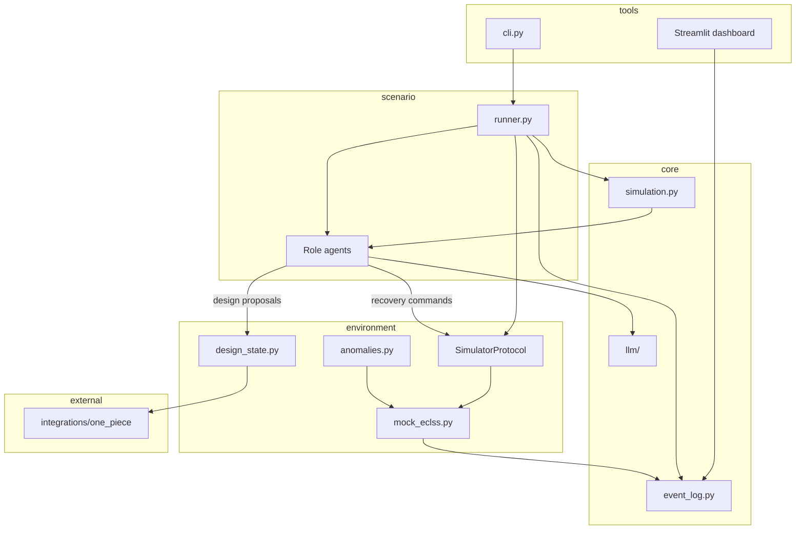

# ECLSS Resilience Loop — ディレクトリ構成 & 1週間 MVP 計画

> 設計プロセス記録。Cursor プラン `ECLSS Agent Directory MVP` から export（2026-05-30）。

## ゴール

**本質**: 精緻な物理モデルより「構造化されたエージェント関係」と「シミュレーターとの確実な API 契約」。

**今回のスコープ（Phase 0）**: コード実装より先に、[lunar_agents](https://github.com/sbilxxxx/lunar_agents) と同型の依存方向を持つディレクトリ骨格を `engineering_agents` に作る。既存コードは `src/materials/` へ移し、ECLSS シナリオ用の新レイヤーを空でも import 可能な状態にする。

### 前提（ユーザー確認済み）

- **リポジトリ方針**: 既存 bar sim は `src/materials/` に退避。`src/` 配下に `core`, `environment`, `experiments`, `scenario`, `scripts`, `tools`。`src` と同レベルに `docs`, `memo`, `tests`。
- **SSOS 連携**: Mock アダプタ先行（ROS2 topic / command API 互換）。後から real SSOS に差し替え。

---

## 目標ディレクトリ構成

```text
engineering_agents/
├── src/
│   ├── materials/                          # 既存 bar sim（原則変更しない参照実装）
│   │   └── 2d-bar-simulation/
│   │       ├── main.py, agent.py, simulation.py, ...
│   │       └── visualization/
│   ├── core/                               # ドメイン非依存カーネル
│   │   ├── simulation.py                   # 2-phase step loop（lunar_agents/core 相当）
│   │   ├── agent.py                        # Agent 基底 + structured message 契約
│   │   ├── event_log.py                    # JSONL 書き込み（messages / events / metrics）
│   │   └── llm/
│   │       ├── base.py
│   │       ├── ollama.py
│   │       └── parsing.py
│   ├── environment/                        # シミュレーター境界（SSOS API）
│   │   ├── protocol.py                     # SimulatorProtocol（後述）
│   │   ├── ssos/
│   │   │   ├── mock_eclss.py               # Week-1 本体: 簡易 ECLSS + ROS2-like topics
│   │   │   ├── adapter.py                  # real SSOS 差し替え口（Week-1 は NotImplemented stub）
│   │   │   └── topics.py                   # topic / command 名定数
│   │   └── eclss_ops/
│   │       ├── telemetry.py                # 生テレメトリ → エージェント向け観測
│   │       ├── anomalies.py                # 複合アノマリー注入
│   │       ├── commands.py                 # 一時回復コマンド（bypass, fan boost, ...）
│   │       └── design_state.py             # トポロジ / 設計パラメータの mutable state
│   ├── scenario/                           # シナリオ定義 + runner
│   │   ├── base.py
│   │   ├── runner.py
│   │   └── scrubber_degradation/
│   │       ├── scenario.yaml               # デモ用: Scrubber 効率低下 + CO2 上昇
│   │       └── agents.yaml                 # ロール定義（Monitor / Diagnostician / Operator / DesignEng）
│   ├── experiments/
│   │   ├── configs/                        # run 用 YAML（duration, llm, output_dir）
│   │   └── results/                        # gitignore（041922_output 相当）
│   ├── scripts/                            # セットアップ・ワンショット実行
│   └── tools/
│       ├── cli.py                          # `run`, `list`, `replay`
│       └── dashboard/
│           └── app.py                      # Streamlit: 左=チャット / 右=健康状態グラフ
├── integrations/
│   └── one_piece/
│       ├── client.py                       # 設計変更の記録・読み出し（JSON SSOT ファイル）
│       └── ssot_schema.json                # One Piece domain の MVP サブセット
├── docs/
│   ├── architecture.md
│   ├── api-contracts.md                    # SimulatorProtocol + JSONL スキーマ
│   └── scenario-scrubber-degradation.md
├── memo/                                   # 調査・設計メモ（lunar_agents/memo 相当）
├── tests/
│   ├── core/
│   ├── environment/
│   └── scenario/
├── pyproject.toml                          # `src` レイアウト + package name
├── requirements.txt
└── README.md                               # 新アーキテクチャの入口に更新
```

### lunar_agents から踏襲する設計原則

| 原則 | 適用 |
| --- | --- |
| 依存方向 `tools → scenario → environment → core` | import ルールを `docs/architecture.md` に明記 |
| `materials/` は参照専用 | 既存 `main.py` 等を `src/materials/2d-bar-simulation/` へ移動のみ |
| 出力は `experiments/results/` | `041922_output/messages.jsonl` パターンを拡張（下記スキーマ） |
| シナリオ YAML + runner | [lunar_agents/scenarios/runner.py](https://github.com/sbilxxxx/lunar_agents/blob/main/scenarios/runner.py) を薄く参考に |

---

## レイヤー間 API 契約（MVP の核）



### `SimulatorProtocol`（`src/environment/protocol.py`）

Week-1 Mock が満たすべき最小インターフェース:

```python
class SimulatorProtocol(Protocol):
    def step(self) -> TelemetrySnapshot: ...
    def apply_command(self, cmd: RecoveryCommand) -> CommandResult: ...
    def apply_design_change(self, change: DesignChange) -> DesignState: ...
    def get_topology(self) -> TopologyGraph: ...
    def get_design_parameters(self) -> dict[str, float]: ...
```

- **TelemetrySnapshot**: `co2_ppm`, `scrubber_efficiency`, `power_margin_w`, `step`, `anomaly_flags[]`
- **RecoveryCommand**: `set_fan_speed`, `enable_bypass`, `reduce_load` 等（Mock 内で状態方程式を更新）
- **DesignChange**: `add_edge(node_a, node_b, kind="bypass")`, `set_parameter(key, value)` — エージェント提案 → 人間/ポリシー承認 → 適用

Real SSOS は `src/environment/ssos/adapter.py` が同 Protocol を実装するだけで差し替え可能（ROS2 topic 名は `topics.py` に固定）。

---

## イベントログスキーマ（UI / One Piece 共通入力）

既存 `041922_output/messages.jsonl` を拡張し、Streamlit が tail できる単一 run ディレクトリに集約:

| ファイル | 内容 | 例 |
| --- | --- | --- |
| `messages.jsonl` | エージェント間チャット（構造化） | `{step, from_role, to_role, message, message_type, reasoning}` |
| `telemetry.jsonl` | 物理生データ | `{step, co2_ppm, scrubber_efficiency, ...}` |
| `health_metrics.jsonl` | UI 用集約 | `{step, co2_status, power_status, overall}` |
| `events.jsonl` | コマンド・設計変更・アノマリー | `{step, kind, actor, payload}` |
| `design_state.jsonl` | トポロジ/パラメータのスナップショット | `{step, topology, parameters}` |
| `summary.json` | run 終了時 KPI | 回復時間、最終 CO2、設計変更数 |

Streamlit (`src/tools/dashboard/app.py`) は **ファイル tail + step スライダー同期** のみ。リアルタイム WebSocket は Week-1 外。

---

## One Piece 連携（MVP 最小）

[one-piece](https://github.com/hirototamura/one-piece) 全 UI は Week-1 外。**設計変更のトラック**に絞る:

1. **Topology ingest（任意・Day 5）**: [ssos.py](https://github.com/hirototamura/one-piece/blob/main/packages/connectors/one_piece_connectors/ssos.py) で SSOS repo から `SystemElement` + ICD を JSON 化 → `integrations/one_piece/ssot_schema.json` に seed
2. **Mutation record**: エージェントが `DesignChange` を提案するたび `events.jsonl` + One Piece 互換 `SsotProvenanceRecord` を `integrations/one_piece/client.py` 経由で append
3. **追跡対象**: ノード接続（scrubber → manifold → cabin）と `DesignParameter`（efficiency, bypass_flow, fan_power）

git submodule または `pip install -e ../one-piece/packages/connectors` のどちらかを `docs/architecture.md` で選定（Week-1 推奨: **JSON ファイル + 将来 connector** で dependency を最小化）。

---

## デモシナリオ: `scrubber_degradation`

`src/scenario/scrubber_degradation/scenario.yaml`:

- **初期状態**: ECLSS baseline（CO2 ≈ 800 ppm、scrubber efficiency 0.95）
- **Step 20**: 複合アノマリー — scrubber efficiency 線形低下 + 電力マージン縮小
- **エージェントロール**（4体、lunar_agents の structured message 形式を流用）:
  - **Monitor**: テレメトリ閾値検知 → `message_type: alert`
  - **Diagnostician**: 原因仮説 → `message_type: diagnosis`
  - **Operator**: 一時回復コマンド発行 → `events.jsonl` に `recovery_command`
  - **DesignEngineer**: bypass 配管追加等 → `design_change` 提案
- **成功条件**: CO2 が安全域（< 1000 ppm）に戻り、設計変更が `design_state` に反映

---

## 1週間 MVP ロードマップ

| Day | 成果物 | 主要ファイル |
| --- | --- | --- |
| **1** | ディレクトリ移行 + `pyproject.toml` + import 可能な空パッケージ | 全体骨格、`src/materials/` 移動 |
| **2** | Mock ECLSS + `SimulatorProtocol` + `telemetry.jsonl` | `mock_eclss.py`, `protocol.py` |
| **3** | core 抽出（sim loop, LLM, event_log）+ scenario runner 骨格 | `core/simulation.py`, `scenario/runner.py` |
| **4** | 4 ロールエージェント + アノマリー注入 + 回復コマンド | `eclss_ops/`, `agents.yaml` |
| **5** | 設計変更フロー + One Piece JSON provenance | `design_state.py`, `integrations/one_piece/` |
| **6** | Streamlit ダッシュボード（チャット + CO2 グラフ同期） | `tools/dashboard/app.py` |
| **7** | E2E デモ run + `docs/api-contracts.md` 確定 | `experiments/configs/scrubber_demo.yaml` |

**Week-1 でやらないこと**（明示的に defer）:

- Real SSOS / ROS2 ランタイム接続
- One Piece Web UI (`apps/web`) 統合
- 複数シナリオ・batch sweep（lunar_agents の `experiments/plans/` 相当）
- 041922_output 級の動画生成（Streamlit で十分）

---

## Day 1 移行手順（実装時の具体ステップ）

1. `src/` ツリーと空 `__init__.py` を作成
2. ルートの `main.py`, `agent.py`, `simulation.py`, `ollama_client.py`, `utils.py`, `visualization.py`, `config.yaml`, `visualization/` を `src/materials/2d-bar-simulation/` へ移動
3. ルートに `pyproject.toml` を追加（`packages = [{include = "src"}]` または src layout）
4. `src/core/` に lunar_agents から **コピー＆一般化**（bar/place 依存を除去した simulation loop + llm）
5. ルート `README.md` に「materials = 旧 sim」「scenario/scrubber_degradation = 新 ECLSS sim」の二系統を記載
6. `.gitignore` に `src/experiments/results/`, `simulation.log` を追加

---

## テスト方針（最小）

- `tests/environment/test_mock_eclss.py`: アノマリー注入後 CO2 上昇、回復コマンドで下降
- `tests/scenario/test_runner_smoke.py`: LLM なし deterministic stub agent で 5 step 完走
- `tests/core/test_event_log.py`: JSONL スキーマ整合

LLM 統合テストは手動 smoke のみ（lunar_agents と同様）。

---

## 成功判定（MVP Done）

1. `python -m src.tools.cli run --scenario scrubber_degradation --config scrubber_demo` が完走
2. `experiments/results/<run_id>/` に 6 種ログ + `summary.json` が出力
3. `streamlit run src/tools/dashboard/app.py -- --run experiments/results/<run_id>` で左チャット・右 CO2 グラフが step 同期
4. 設計変更（bypass 追加）が `design_state.jsonl` と One Piece provenance JSON に記録

---

## 実装タスク一覧

- [ ] src/ 骨格作成: materials, core, environment, scenario, experiments, scripts, tools + ルート docs/memo/tests
- [ ] 既存 bar sim を src/materials/2d-bar-simulation/ へ移行し import パスを修正
- [ ] SimulatorProtocol + JSONL スキーマを environment/protocol.py と docs/api-contracts.md に定義
- [ ] mock_eclss.py で CO2/scrubber/電力の簡易モデルと ROS2-like topic 定数を実装
- [ ] lunar_agents から simulation loop / llm / event_log を core/ に一般化移植
- [ ] scrubber_degradation シナリオ YAML + runner + 4 ロールエージェント
- [ ] integrations/one_piece/ で設計変更 provenance 記録（JSON SSOT）
- [ ] tools/dashboard/app.py: messages + health_metrics の step 同期 UI
- [ ] experiments/configs/scrubber_demo.yaml + CLI + smoke test で E2E デモ完走
